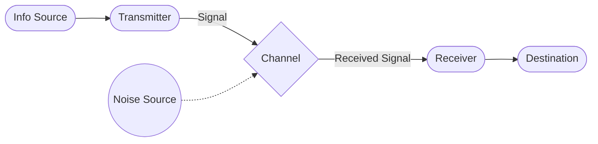

---
tags:
  - InformationTheory
  - ReadingNote
  - ClassicPaper
date: 2026-03-03
---

# Reading: A Mathematical Theory of Communication (1948)

> [!info] Paper Info
> - **Author**: [[Claude Shannon]]
> - **Source**: *The Bell System Technical Journal*
> - **Link**: [PDF](./A_Mathematics_Theory_of_Communication.pdf)

## Introduction

> The fundamental problem of communication is that of reproducing at one point either exactly or approximately a message selected at another point.

### The General Communication System

Shannon proposes a general model with 5 parts:

1. **Information Source**: Produces a message.
2. **Transmitter**: Operates on the message to produce a signal suitable for transmission over the channel.
3. **Channel**: The medium used to transmit the signal from transmitter to receiver.
4. **Receiver**: Performs the inverse operation of the transmitter, reconstructing the message from the signal.
5. **Destination**: The person (or thing) for whom the message is intended.

## Part I: Discrete Noiseless Systems

### 1. The Discrete Noiseless Channel

> [!question] Question
> Why does Shannon define capacity using **time duration** of signals? Why not just count symbols?

**Core Concept: Capacity $C$**

In a physical channel (like telegraphy), different symbols take different amounts of time to transmit.
- **Example (Telegraphy)**:
  - Dot ($\cdot$): 1 unit of time
  - Dash (—): 3 units of time
  - Space: 1 unit of time

If we only counted "symbols per second", we'd be inaccurate because sending a "Dash" is "more expensive" (takes longer) than a "Dot".

**Definition of Capacity:**

Shannon defines capacity $C$ based on the number of possible allowed signal sequences $N(T)$ of duration $T$.

$$
C = \lim_{T \to \infty} \frac{\log N(T)}{T}
$$

- **$N(T)$**: The number of distinct messages (sequences of symbols) that can be sent in time $T$.
- **$\log N(T)$**: Measures the "information" (in bits, if base 2) contained in these sequences.
- **$/ T$**: Normalizes it to **information per unit time**.

**How to calculate $N(T)$? (The Difference Equation)**

If we have symbols with durations $t_1, t_2, \dots, t_n$, the number of sequences of length $T$ is the sum of sequences ending with each symbol:

$$
N(T) = N(T - t_1) + N(T - t_2) + \dots + N(T - t_n)
$$

- This is a [[Mathematics_Knowledge#Linear Difference Equations|linear difference equation]].
- The solution is asymptotic to $X_0^T$, where $X_0$ is the largest real root of the characteristic equation: $X^{-t_1} + X^{-t_2} + \dots + X^{-t_n} = 1$.
- Thus, **$C = \log X_0$**.

**Generalization: Finite State Constraints**

Previously, we assumed symbols could be chosen independently (or only constrained by their durations). However, real systems often have **states** (e.g., in telegraphy, spaces cannot be sent consecutively).

Shannon generalizes the capacity definition to systems with **Finite State Constraints**:
- **Model**: A graph where nodes are states and edges are symbols (with durations $t_{ij}^{(s)}$).
- **Capacity Definition**: The capacity $C$ remains $\lim_{T \to \infty} \frac{\log N(T)}{T}$, but $N(T)$ now counts the allowed paths in the state graph.

> [!math]- Derivation: How to count $N(T)$ in systems with Finite State Constraints
> **1. Define Variables:**
> - $s$: A specific symbol (transition) from state $i$ to state $j$.
> - $t_{ij}^{(s)}$: The duration of symbol $s$ that transitions from state $i$ to state $j$.
> - $N_j(T)$: The number of allowed signal sequences of total duration $T$ that end in state $j$.
> 
> **2. System of Difference Equations:**
> The number of sequences ending in state $j$ at time $T$ is the sum of sequences coming from all possible previous states $i$:
> 
> $$
> N_j(T) = \sum_{i, s} N_i(T - t_{ij}^{(s)})
> $$
> 
> This is a system of linear difference equations (one for each state $j$).
> 
> **3. Assuming an Exponential Solution:**
> Just like in the single-state case, we look for a solution where the count grows exponentially with time. We assume:
> $$ N_j(T) = B_j W^T $$
> Substituting this into the difference equation:
> $$ B_j W^T = \sum_{i, s} B_i W^{T - t_{ij}^{(s)}} $$
> Dividing by $W^T$:
> $$ B_j = \sum_{i, s} B_i W^{-t_{ij}^{(s)}} $$
> 
> **4. The Matrix Form:**
> Rearranging terms to group by $B_i$:
> $$ \sum_{i} B_i \left( \sum_s W^{-t_{ij}^{(s)}} - \delta_{ij} \right) = 0 $$
> where $\delta_{ij}$ is the Kronecker delta (1 if $i=j$, 0 otherwise).
> 
> For this system of linear equations to have a non-trivial solution (where not all $B_i$ are zero), the **determinant of the coefficient matrix** must be zero:
> 
> $$
> \det \left( \sum_s W^{-t_{ij}^{(s)}} - \delta_{ij} \right) = 0
> $$
> 
> **5. Result:**
> Solving this determinant equation gives a polynomial in $W$. The capacity is:
> $$ C = \log W_0 $$
> where $W_0$ is the largest real root of the equation.

